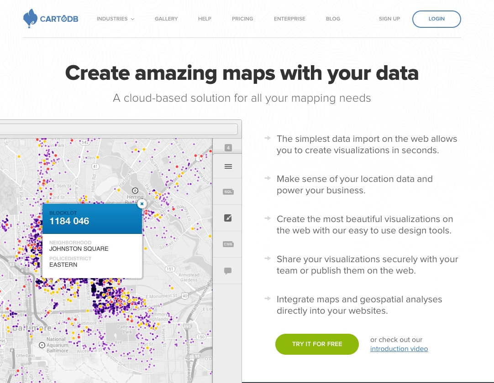
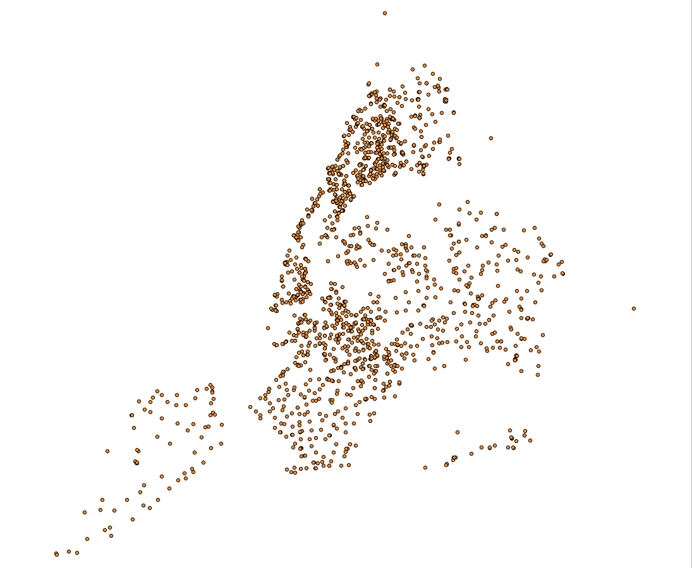
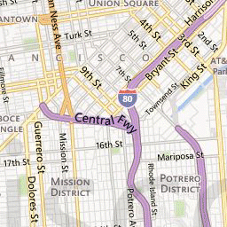

CartoDB Dorkshop Tutorial
==========
Parsons, The New School For Design  
August 9, 2014

## About Me

I ([Chris Henrick](https://twitter.com/chrislhenrick)) have a professional background in Cartography and Geographic Information Systems. In undergrad I studied human geography, urban studies and fine art. Recently I have gotten more into web development, data visualization and interactive web-mapping.

## What is this Dorkshop about?

Mapping data interactively on the web using the free open-source software called CartoDB. 

### Examples / Use Cases:

- [The Spatial Distribution of Swiss Soccer Fans](http://www.tagesanzeiger.ch/extern/interactive/2014/fankarte/)
- [Where Would 9 million displaced Syrians fit?](http://projects.aljazeera.com/2013/syrias-refugees/index.html)
- [The Geography of Abortion Access](http://www.thedailybeast.com/articles/2013/01/22/interactive-map-america-s-abortion-clinics.html	)
- [Andrew Hill's NYC PLUTO data tour](http://andrewxhill.com/cartodb-examples/scroll-story/pluto/#0)
- [Anti-Eviction Mapping Project](http://www.antievictionmappingproject.net/ellis.html)
- [Tweets about Beyonce's latest album release](http://www.huffingtonpost.com/2013/12/16/beyonce-twitter_n_4455491.html)


## What is CartoDB?



CartoDB is a platform running on open-source software for visualizing and analzying data on interactive web-maps. It is perhaps the easiest method of mapping geospatial data for the web. It also allows for high cartographic customization through an intuitive user interface as well as advanced geospatial data analysis using [SQL](http://en.wikipedia.org/wiki/Sql) (Structured Queried Language) and [Post-GIS](http://boundlessgeo.com/solutions/solutions-software/postgis/).

Prior to CartoDB (and other opensource web-cartography software such as [Tile Mill](https://www.mapbox.com/tilemill/)), creating webmaps involved having to have your very own web server and install both server-side and database software. This was _extremely difficult_ unless you were a experienced computer programmer / back-end web developer. The great thing about CartoDB is that it handles all of the server side stuff for you. For example, each time you import data into CartoDB that data is automatically stored inside a database that has _geospatial_ capabilities.

### Geospatial? Wait, what???

__Geospatial data__ refers to data that has a location based, geometric component. Most geospatial data is in _vector format_ and is stored as points, lines and polygons whose vertices have real world x, y coordinates such as latitude and longitude. In [GIS](http://en.wikipedia.org/wiki/Geographic_information_system), geospatial data can be used to represent both physical and cultural features. These data can then be cartographically rendered and analyzed to solve problems and model the enviroment. 

### Examples of Geometry Types:

- A list of street addresses, which can then be __georeferenced__ (matched) to individual pairs of latitude longitude coordinates (points), such as the locations of all public schools in NYC:
   
  
  
- Features such as rivers and streams or road networks can be stored as lines:
   
  
  
- New York City's borough boundaries (or other administrative boundaries such as states, provinces and countries) can be stored as polygons:
  
  

### Map Tiles

These types of data are used to render __map tiles__ like those you see on [OpenStreetMap](http://www.openstreetmap.org), Google Maps, Bing, Map Quest, etc. For example these are map tiles from different providers for the same area of San Francisco:



Map tiles are small 256 x 256 pixel images that are "tiled" together in a grid like and pyramid fashion. They are broken up this way to make zooming and panning appear seamless and fluid by the web-map user. Only the images inside and just outside the map area the user is looking at are being rendered. The server is told to render neighboring tiles and to _cache_ them so that when you pan to a new area the interaction appears seamless. 

For web mapping map tiles form our _basemap_ that we can overlay _custom data_ on top of. Even more though, we can _analyze_ our geospatial data with CartoDB. This is where the fun comes in :)

### Analyzing Geospatial data with PostGIS

__PostGIS__ (along with PostgreSQL) is the open-source technology that allows for doing geospatial analysis in CartoDB. Why would we want to use this over other types of GIS software?

- Replicable - you can script your workflow, which is great for leaving a trail of your work.
- It builds on SQL - if you already know SQL, this is an easy way to get into doing GIS analysis.
- You can query data dynamically - if you have a server that can crunch a PostGIS query and return JSON, you can do dynamic spatial queries in your apps. e.g. "Find me all points near me."

If you are interested you can find another introductory tutorial about using PostGIS in CartoDB [here](https://github.com/csvsoundsystem/nicar-cartodb-postgis/blob/gh-pages/README.md#postgis). We will cover some basic PostGIS in this tutorial though.


## The Tutorial

### Intro to the CartoDB Dashboard

1. Create a free account and log into CartoDB. In the dashboard, select the `public data` option then `populated places` to add the dataset to your account. Take a look at the  `adm0cap field` in the __table view__ dashboard. This field stores 0's and 1's, with the latter being for country capitals.

2. A walk through the GUI:
    - When inspecting a data table there are two ways to view your data in CartoDB: 
      - __Table View__: shows column names & rows, like a spreadsheet. For this dataset each row represents a point. But they may also represent other geometry types depending on your data.
        - Take a look at what's inside the cells in `the_geom` column, You should see lattitude and longitude coordinates.
      - __Map View__: Allows for inspecting our data visually, eg: zooming and panning. We can also change the base map, use the Visualization Wizard in the side bar to style data and add interaction such as pop-ups that display values from our table view. 
      
    - In the Visualization Wizard try switching the data's style to _category view_, choose the `adm0cap` column and assign different image markers to `adm0cap` for country-capital vs. regular populated place.
    
    - You may also upload custom images to be used as markers.

3. Demonstrate Publishing / Sharing a Map: 

    - By clicking on the `Visualize` button in the upper right corner we can create a `Visualization`. Do this and give your visualization a name such as "My First Viz". 
    
    - When we create a visualization it will inherit the styles we set from our map view. 
    
    - Visualizations work by linking to your data tables. Note that if we go back to inspecting our imported data table and change the styles from here the visualization we made with that data _will not_ be updated with those styles. However if you make any changes to the values in those tables the corresponding visualization _will_ be affected.
    
    - __Note__: any changes we make to our visualization will be updated in real time to anyone viewing our viz!
    
    - Notice the differnces between the __tables__ and __visualizations__ dashboards. The former is just the  data you have imported to your account, the latter are the maps you create with your data and may choose to share / publish. A single Visualization may link to multiple tables in the form of layers.

### Making a Choropleth Map

1. Delete the populated places dataset and visualization we made as we'll need the storage space to move forward with the next part of the tutorial using a free account. 

2. Import the U.S. counties data from the following URL: `http://acdmy.org/d/counties.zip`  
   __Tip:__ you can just copy and paste this link after clicking the "add data" button from the tables dashboard. No need to download it first!

3. Take a look at what the values are inside the cells in `the_geom` column. You should see something like:  
   
   ```
{"type":"MultiPolygon","coordinates":[[[[-69.99693763,12.5775821],[-69.93639075,12.53172435],[-69.924672,12.51923249],[-69.91576087,12.49701569],[-69.88019772,12.45355866],[-69.87682044,12.42739492],[-69.8880916,12.41766999],[-69.90880286,12.41779206],[-69.93053138,12.42597077],[-69.94513913,12.44037507],[-69.924672,12.44037507],[-69.924672,12.447211],[-69.95856686,12.46320222],[-70.02765866,12.52293529],[-70.04808509,12.53115469],[-70.05809486,12.53717683],[-70.06240801,12.54682038],[-70.0603735,12.55695222],[-70.05109616,12.57404206],[-70.04873613,12.5837263],[-70.05264238,12.60000235],[-70.05964108,12.61424388],[-70.06110592,12.62539297],[-70.04873613,12.63214753],[-70.00715085,12.58551667],[-69.99693763,12.5775821]]]]}
   ```

4. Now switch to the __map view__ to see how the polygons overlayed on U.S.  
   In the Visualization Wizard:
    - try changing the base map.
    - try changing the polygon fills and borders.
    
5. Demo info windows, Notice how you may:
    - turn columns on or off.
    - edit the name to be displayed in the info window.
    - change the style of info windows.
    - customize them with HTML.
    
6. Demo Choropleth map with `pop` column
    - __Problem:__ mapping population by county gives a false impression to the viewer of our map. We need to use population density instead as a value for comparison.
    - Our data has this value already included but to show how you could compute it on your own we would do the following.
    - Normalize the data: divide the number of people in a county by its area.
    - the SQL code to enter into the SQL window:
    
    ```
    SELECT pop_sqkm, 
    	round(
    		pop / 
    		(ST_Area(the_geom::geography)/1000000)) 
    	as psqkm 
    	FROM us_counties
    ```

### Making a Thematic Point Map

1. Use this tornado data: `http://acdmy.org/d/tornadoes.zip` and import it as we did with the county data.

2. Inspect data. Because this data is in CSV format it stores all of our data types as strings. In order to use the numeric and date values in this data we need to convert the following columns' data types: 
    - convert `damage` to  number type
    - convert `date` to date type
        
3. In the map view use the Visualization Wizard to show our data's `damage` value in different methods such as Bubble Map, intensity, density map, etc.

4. (TO DO) Try adding labels to our map.

5. (TO DO) Data Filtering, show how this gets translated to SQL. 

### Animating Geospatial Data with Torque

1. Use the same tornado data from above.

2. Demo the Torque option in the Visualization Wizard.	

### Making a Multi-Layered Data Cake

- Let's combine both datasets from the last parts into a new visualization.

- We can use PostGIS to count the number of tornadoes per county. Create a new column called `tornadoes_by_county` and give it a numeric data type. 

- Then in the SQL window run the following query ( this assumes your tornado data table is named `tornadoes`)

  ```
	UPDATE us_counties 
	  SET tornadoes_by_county = 
	  (
	      SELECT count(1) 
	      FROM tornadoes 
	      WHERE st_contains(us_counties.the_geom,tornadoes.the_geom) 
	  )
  ```
- That's it folks!

## Resources
### Learning
- CartoDB [Map Academy](http://academy.cartodb.com/). Much of what we covered in this tutorial comes from here.
- CartoDB [tutorials page](http://docs.cartodb.com/tutorials.html). Covers many more topics relating to GIS and web-mapping individually.
- Intro to [using PostGIS with CartoDB](https://github.com/csvsoundsystem/nicar-cartodb-postgis/blob/gh-pages/README.md#postgis) by [Michael Keller](https://github.com/mhkeller)

### Reference
- [CartoDB documentation](http://docs.cartodb.com/)
- [CartoDB API documentation](http://docs.cartodb.com/cartodb-platform.html)
- [PostGIS website](http://postgis.refractions.net/)

### Support
- Search [GIS StackExchange](http://gis.stackexchange.com/questions/tagged/cartodb) using the tags `cartodb` and/or `postgis`.


### Code Examples
More advanced. For using the CartoDB API. Requires a basic knowledge of Javascript for the web.

- Andrew Hill's [blocks](http://bl.ocks.org/andrewxhill)
- Javi Santana's [blocks](http://bl.ocks.org/javisantana)

### More CBD Map Examples
- CartoDB [Map Gallery](http://cartodb.com/gallery)
- Andrew Hill's [maps](https://andrew.cartodb.com/page/1)
- CartoDB team [maps 1](https://osm2.cartodb.com/page/1)
- CartoDB team [maps 2](https://team.cartodb.com/)

### Geospatial data sources
1. [Natural Earth Data](http://www.naturalearthdata.com/): 3 levels of small-scale cultural and physical data, world coverage.
2. [Metro Extracts](http://metro.teczno.com/): OpenStreetMap extracts of urban areas converted to shapefile and other formats.
3. [Geofabrik](http://download.geofabrik.de/): Continental & Country OSM extracts.
4. [OpenStreetMapData.com](http://openstreetmap-data.com/data): OSM Land, Water, Coastline data
5. [Open Data NYC](https://nycopendata.socrata.com/) All sorts of goodies like 311 data. Much of the data here is already georeferenced.
6. [US National Weather Service](http://www.nws.noaa.gov/geodata/) (NOAA) 
7. [U.S. Census](http://www.census.gov/2010census/data/): Demographic data for the U.S.

__Note / Tip:__  
Any data with a spatial attribute, (such as street addresses, county names, state / province names, country names, zipcodes, IP addresses, etc.) but that doesn't have a geometry can be _georeferenced_ to geospatial data that does have a geometry. Typically the preferred format to work with this type of data is CSV (comma separated value) but CartoDB also allows for importing Microsoft Excel tables. _Make sure your data's first row are column names and that these names don't contain spaces, numbers or special characters._


### Happy Mapping!


