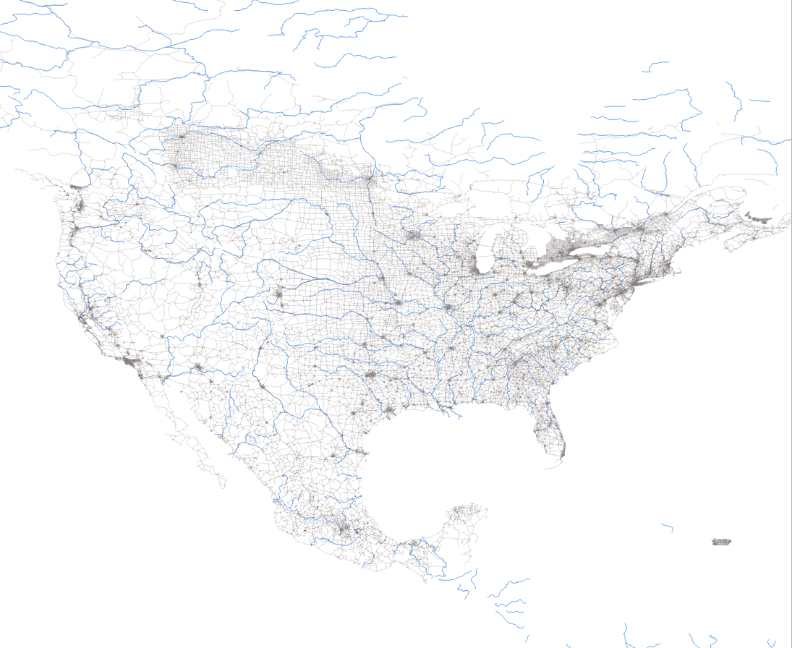

CartoDB Dorkshop Tutorial
==========
Parsons, The New School For Design  
August 9, 2014

## About Me

I ([Chris Henrick](https://twitter.com/chrislhenrick)) have a professional background in Cartography and Geographic Information Systems. In undergrad I studied human geography, urban studies and fine art. Recently I have gotten more into web development, data visualization and interactive web-mapping.

## What is this Dorkshop about?

Mapping data interactively on the web using free open-source software called CartoDB. 

### Examples / Use Cases:

- [The Spatial Distribution of Swiss Soccer Fans](http://www.tagesanzeiger.ch/extern/interactive/2014/fankarte/)
- [Where Would 9 million displaced Syrians fit?](http://projects.aljazeera.com/2013/syrias-refugees/index.html)
- [The Geography of Abortion Access](http://www.thedailybeast.com/articles/2013/01/22/interactive-map-america-s-abortion-clinics.html	)
- [Andrew Hill's NYC PLUTO data tour](http://andrewxhill.com/cartodb-examples/scroll-story/pluto/#0)
- [Tweets about Beyonce's latest album release](http://www.huffingtonpost.com/2013/12/16/beyonce-twitter_n_4455491.html)


## What is CartoDB?


CartoDB is a platform running on open-source software for visualizing and analzying data on interactive web-maps. It is perhaps the easiest method of mapping geospatial data for the web. It also allows for high cartographic customization through an intuitive user interface as well as advanced geospatial data analysis using [SQL](http://en.wikipedia.org/wiki/Sql) (Structured Queried Language) and [Post-GIS](http://boundlessgeo.com/solutions/solutions-software/postgis/).

Prior to CartoDB (and other opensource web-cartography software such as [Tile Mill](https://www.mapbox.com/tilemill/)), creating webmaps involved having to install server-side software. This was _extremely difficult_ unless you were a computer programmer / back-end web developer. The great thing about CartoDB is that it handles all of the server side stuff for you. For example, each time you import data into your dashboard in CartoDB that data is automatically stored inside a database that has _geospatial_ capabilities.

### Geospatial? Wait, what???

__Geospatial data__ refers to data that has a location based, geometric component. Most geospatial data is in _vector format_ and is stored as points, lines and polygons whose vertices have real world x, y coordinates such as latitude and longitude. In [GIS](http://en.wikipedia.org/wiki/Geographic_information_system), geospatial data can be used to represent both physical and cultural features. These data can then be overlayed and analyzed to solve problems and model the enviroment. 

__Examples of each geometry type:__

- A list of street addresses, which can then be __georeferenced__ (matched) to individual pairs of latitude longitude coordinates (points), such as the locations of all public schools in NYC:
   
  
  
- Features such as rivers and streams or road networks can be stored as lines:
   
  
  
- New York City's borough boundaries or other administrative boundaries such as states and countries can be stored as polygons:
  
  

These types of data are what is used to render __map tiles__ like those you see on Google Maps, Bing, Map Quest, etc. 


Map tiles are small 256 x 256 pixel images that are "tiled" together in a grid like fashion. They are broken up this way so that only the part of the earth you are viewing needs to be rendered. Only the images inside and just outside the map area you are looking at are being rendered. The server is told to render neighboring tiles and to _cache_ them so that when you pan to a new area the interaction appears seamless. 

We can overlay _custom data_ on our web maps and even _analyze_ geospatial data with CartoDB. This is where the fun	 comes in :)

### Analyzing Geospatial data with PostGIS

PostGIS is the open-source technology that allows for doing geospatial analysis in CartoDB. Why would we want to use this over other types of GIS software?

- Replicable - you can script your workflow, which is great for leaving a trail of your work.
- It builds on SQL - if you already know SQL, this is an easy way to get into doing GIS analysis.
- You can query data dynamically - if you have a server that can crunch a PostGIS query and return JSON, you can do dynamic spatial queries in your apps. e.g. "Find me all points near me."

If you are interested you can find an introductory tutorial about using PostGIS in CartoDB [here](https://github.com/csvsoundsystem/nicar-cartodb-postgis/blob/gh-pages/README.md#postgis).


## The Tutorial

### Intro to the CartoDB Dashboard

1. Create a free account and log into CartoDB. In the dashboard, select the `public data` option then `populated places` and add the dataset to your account. Take a look at the  `adm0cap field` in the __table view__ dashboard.

2. Walk through the GUI:
    - There are ways to view your data in CartoDB: 
    - __Table View__: shows column names & rows, like Excel. Each row represents a point. SQL console.
    - Show what's inside cells in `the_geom` column: lat and lon coordinates.
    - __Map View__: Allows for zooming and panning, changing the base map, using the side bar Wizard to style data. 
    - In the style wizard try switching data style to _category view_, choose the `adm0cap` column and assign markers to `adm0cap` for country-capital vs. regular populated place
    - mention you can load custom images for markers

3. Demonstrate publishing: 
    - By clicking on the `Visualize` button we can create a `Visualization` and share our map with the world via a URL, iframe or viz.json.
    - __Note__: any changes we make to our visualization will be updated in real time!
    - Notice the differnces between the __tables__ and __visualizations__ dashboards. The former is just the  data you have imported to your account, the latter are the maps you create with your data and may share / publish. Visualizations may link to multiple tables in the form of layers.

### Making a Choropleth map

1. Delete the populated places dataset and visualization we made as we'll need the storage space for the free account. 
2. Import the U.S. counties data from the URL: `http://acdmy.org/d/counties.zip`
3. Take a look at what the values are inside the cells in `the_geom` column.
4. Now switch to the __map view__ to see how the polygons overlayed on U.S.
    - try changing the base map.
    - try changing the polygon fills and borders.
5. Demo info windows
    - turn on /off columns.
    - change style of info windows.
    - mention you can customize them with HTML.
6. Demo Choropleth map with `pop` column
    - __important:__ mapping population by county gives a false impression, we need to use population density.
    - Let's normalize the data: divide number of people by area to have a normalized value to compare. 
    - SQL:
    
    ```
    SELECT pop_sqkm, 
    	round(
    		pop / 
    		(ST_Area(the_geom::geography)/1000000)) 
    	as psqkm 
    	FROM us_counties
    ```

### Making a Choropleth point map
1. Use this tornado data: `http://acdmy.org/d/tornadoes.zip`
2. Inspect data & convert columns damage to number and date to date format (because CSV)
3. Demo Wizard to show types of viz like Bubble Map, intensity, density map
4. Add labels
5. Data Filtering, show how this gets translated to SQL.

### Animating Data with Torque
1. Use the tornado data from above: `http://acdmy.org/d/tornadoes.zip`
2. Demo Torque option in the visualization wizard.	

### Making a multi-layered Viz
Combine datasets from last parts

## Resources
### Learning
- CartoDB [Map Academy](http://academy.cartodb.com/). What we did today comes from here.
- Intro to [using PostGIS with CartoDB](https://github.com/csvsoundsystem/nicar-cartodb-postgis/blob/gh-pages/README.md#postgis) by [Michael Keller](https://github.com/mhkeller)

### Reference
- [CartoDB documentation](http://docs.cartodb.com/)
- [CartoDB API documentation](http://docs.cartodb.com/cartodb-platform.html)
- [PostGIS website](http://postgis.refractions.net/)

### Support
- Search [GIS StackExchange](http://gis.stackexchange.com/questions/tagged/cartodb) using the tags `cartodb` and/or `postgis`.


### Code Examples
- Andrew Hill's [blocks](http://bl.ocks.org/andrewxhill)
- Javi Santana's [blocks](http://bl.ocks.org/javisantana)

### More CBD Map Examples
- CartoDB [Map Gallery](http://cartodb.com/gallery)
- Andrew Hill's [maps](https://andrew.cartodb.com/page/1)
- CDB team [maps 1](https://osm2.cartodb.com/page/1)
- CDB team [maps 2](https://team.cartodb.com/)

### Geospatial data sources
1. Natural Earth Data: (3 levels of small-scale, world coverage)
http://www.naturalearthdata.com/
2. Metro Extracts: (OSM extracts of urban areas converted
to shapele and other formats)
http://metro.teczno.com/
3. Geofabrik (Continental & Country OSM extracts):
http://download.geofabrik.de/
4. OpenStreetMapData.com (OSM Land, Water, Coastline data):
http://openstreetmap-data.com/data
5. Open Data NYC:
https://nycopendata.socrata.com/
6. US National Weather Service (NOAA):
http://www.nws.noaa.gov/geodata/
7. U.S. Census:
http://www.census.gov/2010census/data/


